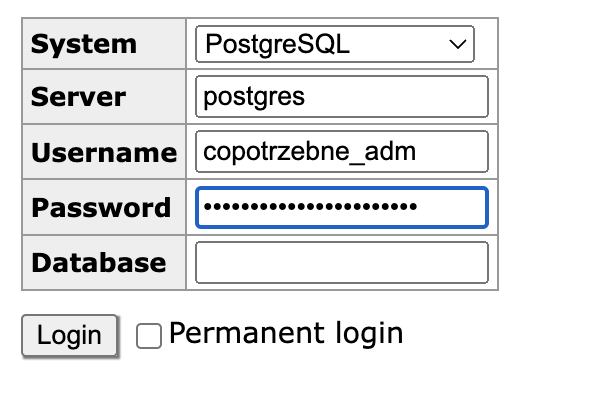

# copotrzebne-api

This is the API for copotrzebne.pl

# important TODOS:
- 
- [x] Prepare Docker for hosting on heroku 
- [x] Configure Sequelize, so it can generate migration files based on models (currently must be done by hand)
- [x] Host the app

# Start the project

1. Copy `.env.dist` to `.env` and fill in env variables

    ```ini
    NODE_ENV=development
    PORT=3000
    API_DB_HOST=localhost
    API_DB_PORT=15432
    API_DB_USERNAME=postgres
    API_DB_PWD=postgres
    API_DB_DATABASE=postgres
    ```

2. Install node modules

    ```bash
    $ yarn install
    ```

3. Run the app

# Running the app

```bash
# watch mode with dockerized or local database
$ yarn start:docker:db
$ yarn start:dev
```

# Sequelize

## About Sequelize with Nest.js

https://docs.nestjs.com/techniques/database#sequelize-integration

## Creating database
```bash
yarn db:create
```

## Dropping database
```bash
yarn db:drop
```

## Generating database migrations

In order to generate migration for Sequelize ORM sequelize-cli is required.
The cli is included in dev modules.
After creating a new entity run command to generate a new db migration.

```bash
npx sequelize-cli migration:generate --name <migration-name>
```

## Running migrations

```bash
$ yarn db:migrate
```

## Example of migration

how to add column to existing table
```javascript
    await queryInterface.addColumn('places', 'building_number', {
      type: Sequelize.STRING(50),
      allowNull: false,
    });
```

# Dockerized DB and Adminer

To login into the adminer use credentials from `.env`
Host is the name of the db service from docker-compose - postgres.

Adminer is hosted on http://localhost:8080



# Infrastructure and deployment

GitHub Actions are used for CI/CD.

Heroku is used for hosting - ~two apps per pipeline: beta and production.~

## Continous Integration

`main.yml` workflow run test on each branch.

## Release to beta

`relsease.yml` workflow push app to Heroku using GIT if test sucessed on branch `master`.

## Promotion to production

~App need to be promoted manually on Heroku, pipeline: `api.copotrzebne.pl`~

## DB

PostgreSQL from Heroku is used.

`DATABASE_URL` contains connection string.

The value of `DATABASE_URL` config var can change at any time.
Do not rely on this value either inside or outside your Heroku app.

## Transactions
We are using [Sequelize managed transactions](https://sequelize.org/master/manual/transactions.html)
and the standard flow looks like this:
- we inject global sequelize instance into controller 
- we open new sequelize transaction inside controller method

```typescript
await this.sequelize.transaction(async (transaction) => {
  /* ... */
});
```

- now we can write all business logic inside the above callback, and it will be wrapped inside the transaction
- every service method that is operating on database should accept transaction as first parameter
- we can now use as many services as we want inside the controller and in case of any error, the whole transaction will roll back automatically

# Testing

## E2E tests

To run e2e tests first you need to run test db container:

```shell
$ yarn start:docker:test-db
```

When db is running, you can run e2e tests many times. Tested api connects to the test db.
Before tests migrations are runned.
After tests db migrations are reverted to clean the db.

Run tests with the command:
```shell
$ yarn test:e2e
```

Add E2E tests files into src/tests/<module>/

## Unit testing

To run unit tests:
```shell
$ yarn test
```

To write unit test, name the file as <something-tested>.spec.ts.
Add unit tests files into src/<module>/<functionality>/


# User Roles

## Admin

Should have access to everything

## Service

Have access to fetch data only - for generating static frontend

## Place Manager

Can access only his own places

# Authorization

To authorize user, use AuthGuard and define allowed roles using SetMetaData.
AuthGuard verifies the session and roles.

```javascript
class SomeController {
   @SetMetadata(MetadataKey.ALLOWED_ROLES, [UserRole.PLACE_MANAGER, UserRole.ADMIN])
   @UseGuards(AuthGuard)
   @Get('/') methodForGet() {}
}
```

To authorize user pass JWT via authorization header.
Header has a following content: `Bearer <jwt_token>`
